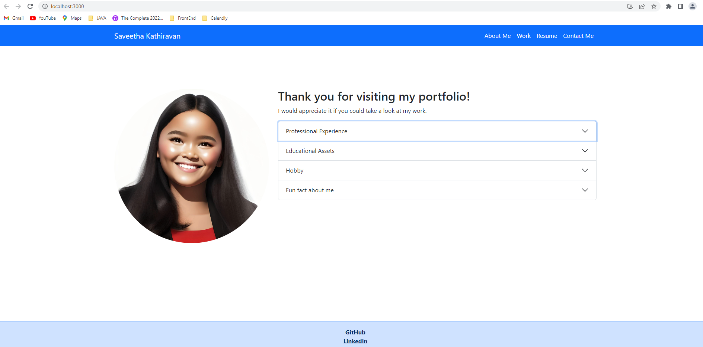

# Portfolio

## Description

This project mainly focuses on creating portfolio using React frame work. It allows employers to easily review the portfolios of employees. It provides a user-friendly interface with sections such as "About Me," "Portfolio," "Contact," and "Resume." 

## Installation

Clone the Git repository
Install node.js
Run npm install to install dependencies.
Run npm start to start the application

## Usage

## Link to Github Repository

https://github.com/saveetha17/portfolio_using_react.git

## Link to Deployed Application

https://saveetha17.github.io/portfolio_using_react/
